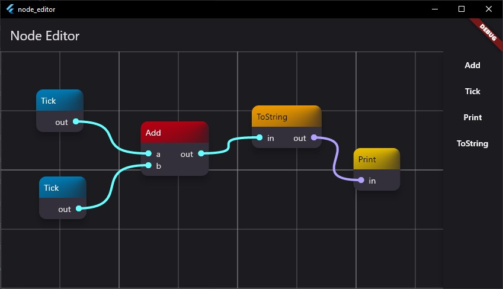

# Node Editor

A very simple node editor inspired by Unreal Engine's Blueprint editor. Doesn't do anything right now except placing nodes and connecting them using edges.

This is a tech demo, not a product.

## Usage

Install flutter, clone the repository, then run `flutter pub get` and then `flutter run` in it.

## LICENSE

Don't use this for anything except as an inspiration (both as a user and as a programmer).
